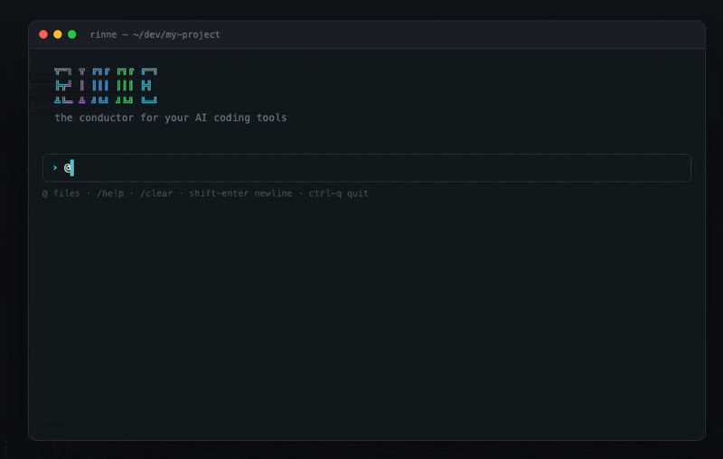
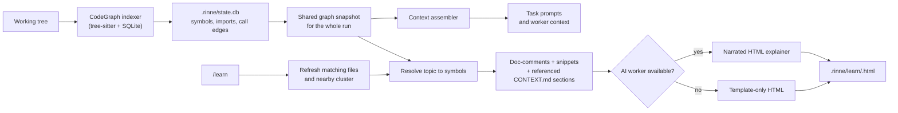

# Rinne

**Local, open-source, terminal-first AI orchestration.**



## Crates Version - 0.1.9

## Install

### macOS app (GUI)

**[Download Rinne for Mac (DMG)](https://github.com/GIKSN-RESEARCH/rinne_macOS/releases/download/v0.1.0/Rinne-0.1.0-macos-arm64.dmg)** — Apple Silicon · [releases](https://github.com/GIKSN-RESEARCH/rinne_macOS/releases)

1. Open the DMG and drag **Rinne** into **Applications**
2. First launch: right-click → **Open** if Gatekeeper warns (ad-hoc signed build until notarized)
3. Optional: run **Install CLI.command** in the DMG to put `rinne` on your PATH
4. From any project folder: `rinne .` (opens the app on that folder, like `code .`)

### CLI only

```bash
curl -fsSL https://raw.githubusercontent.com/GIKSN-RESEARCH/Rinne/main/install.sh | sh
```

Downloads the prebuilt `rinne` binary for your platform, verifies its checksum,
and installs it to `~/.local/bin`. Re-run the same command to upgrade. On
Windows, or to build from source, see [Install & build](#install--build).

---

Rinne is a CLI harness you talk to directly. You tell it what you want done; it plans the work into a graph, distributes that work across the AI coding tools and model APIs already on your machine, and drives it to completion through a verifying generator–evaluator loop. You never open Claude Code, Codex, Grok, or OpenCode yourself — you live in Rinne, and it reaches down to those tools as workers.

The orchestration idea is a *conductor* composing a pool of models into ad-hoc teams. The execution model is a durable *loop* with state on disk. Rinne unifies them: the conductor composes a per-task team, the loop drives long-running work and verification, and the filesystem is the shared substrate that lets heterogeneous workers collaborate.

> Status: v0.1, actively built. Single-machine, single-user. No hosted component, no telemetry, no accounts.

---

## Table of contents

- [Why Rinne](#why-rinne)
- [Principles](#principles)
- [Features](#features)
- [Architecture](#architecture)
- [How a run works](#how-a-run-works)
- [Workers](#workers)
- [The conductor](#the-conductor)
- [MCP tools & Skills](#mcp-tools--skills)
- [Requirements](#requirements)
- [Install & build](#install--build)
- [First-run setup](#first-run-setup)
- [Using Rinne](#using-rinne)
- [Command reference](#command-reference)
- [Configuration](#configuration)
- [Secrets & auth](#secrets--auth)
- [Routing & model selection](#routing--model-selection)
- [Project layout](#project-layout)
- [Development](#development)
- [Privacy & security](#privacy--security)
- [Roadmap](#roadmap)
- [License](#license)

---

## Why Rinne

You already pay for one or more coding-agent subscriptions, or you hold raw API keys, or both. Rinne extracts multi-model orchestration value from that spend **without charging again and without metering**, except where you deliberately use a paid API worker.

It is built for:

- **Subscription users with no API budget** — get multi-model orchestration out of capacity you already bought (Claude Pro/Max, ChatGPT, etc.).
- **API-key users** — a clean local orchestrator over raw model access.
- **Anyone mixing both** — e.g. a cheap API model as the evaluator and a subscription harness as the generator.

## Principles

These are locked.

- **Local only.** Runs on your machine. No hosted component, ever.
- **Open source.** No pricing, no tiers, no accounts.
- **No telemetry, no data fetching.** The only network calls are the worker calls and the conductor backend you configured — plus an optional, cached check of GitHub Releases for a new version, which sends nothing about you and can be disabled (`RINNE_NO_UPDATE_CHECK=1` or `[update] check = false`).
- **Rinne holds no credentials in plaintext.** Each worker is installed and logged in by you the normal way. API keys are stored in your OS keychain (an approved, encrypted deviation) — never written to config files.
- **Terminal-first.** No app, no web UI. A CLI that controls other CLIs.
- **Routing is always narrated, never hidden.** Every routing decision is explained in the transcript.

## Features

- **Conductor planning** — turns a prompt into a JSON DAG of tasks; picks granularity (one node for easy tasks, multi-node graphs with evaluator loops for hard ones).
- **Verifying loop** — generator → evaluator → loop-back with critique, until the goal is met or the budget runs out. Evaluators can be AI, a tool (e.g. tests), or you.
- **Two worker families, one contract** — autonomous harness CLIs *and* raw model APIs, mixed freely in a single plan.
- **Pool-aware tiered routing** — tiers and escalation computed from whatever workers are actually present; a node never dies because its preferred worker is rate-limited.
- **Fully dynamic API support** — any OpenAI-compatible provider, any base URL, any number of keys (rotated across rate limits). Connect-time verification surfaces bad keys/endpoints immediately.
- **Model discovery** — `rinne models <provider>` lists what a key can actually reach, cheapest-first where pricing is reported.
- **Inline TUI** — the transcript goes to native terminal scrollback; a small live viewport shows the plan tree, the active worker's stream, conductor narration, and the prompt.
- **`@`-file mentions** — fuzzy picker over the repo; references are resolved to paths (for harnesses) or inlined as contents (for API workers).
- **Tab-completion** — slash commands and `/config` subcommands/values complete as you type.
- **Persistent, format-preserving config** — view and edit everything via `/config` subcommands or by hand-editing a scaffolded, validated TOML file.
- **MCP tools** — connect any Model Context Protocol server (local `stdio` or remote HTTP); the conductor attaches a server's tools to the nodes that need them, and Rinne runs them by driving an agentic tool loop (API workers) or provisioning the server into the harness (claude-code). Auth via bearer token, API key, or OAuth 2.1 — auto-triggered on a 401.
- **Agent Skills** — install `SKILL.md` instruction packs; the conductor attaches a skill to a node when it fits and injects its instructions into that worker's prompt.
- **Doctor** — detects installed workers, their auth mode (subscription / api-key / free), and warns about metered-billing footguns.

## Architecture

```
                          user
                           |  prompt, approvals, steering, @-mentions
                           v
+----------------------------------------------------------+
|                 RINNE HARNESS INTERFACE                  |
|     REPL / TUI  +  one-shot (rinne -p)  +  slash cmds    |
|     @-file picker  +  live plan tree + stream + steer    |
+----------------------------------------------------------+
        |                    ^                    ^
   goal + state         live events       approvals / human eval
        v                    |                    |
+----------------------------------------------------------+
|  CONDUCTOR (prompted, cheap decoupled backend)           |
|  goal + blackboard digest + worker registry -> JSON DAG  |
|  re-plans on failure, escalation, or new info            |
+----------------------------------------------------------+
        |  emits / amends plan.json
        v
+----------------------------------------------------------+
|  LOOP ENGINE                                             |
|  scheduler | context assembler | dispatcher |           |
|  evaluator gate + loop-back | stuck-detector |          |
|  checkpoint manager | replanner hook | persistence      |
+----------------------------------------------------------+
        |  reads/writes                 |  dispatch
        v                               v
+--------------------+        +---------------------------+
|  BLACKBOARD        |        |  WORKER ADAPTERS          |
|  .rinne/ + repo    |<------>|  harness CLIs  |  APIs    |
|  single source     |        |  claude/grok/  |  openai/ |
|  of truth          |        |  codex/opencode|  deepseek|
+--------------------+        +---------------------------+
```

In one sentence: you prompt Rinne, the conductor turns the prompt plus current state into a JSON DAG, the loop engine schedules that DAG across workers through the blackboard, evaluators gate each result, and the conductor re-plans when something fails — until the goal is met or the budget runs out.

The eight crates of the workspace map onto this:

| Crate | Responsibility |
|-------|----------------|
| `rinne-cli` | Binary entry point, the inline TUI, headless `-p` mode, all subcommands |
| `rinne-types` | Shared base: DAG/plan model, the `Worker` / `Evaluator` / `Replanner` / `Blackboard` trait seams, capability, tool, and skill types |
| `rinne-loop` | The loop engine, scheduler, context assembler, and evaluator gate over the trait seams |
| `rinne-core` | Concrete blackboard + SQLite state, plus the wiring that re-exports the engine |
| `rinne-conductor` | Prompt assembly, plan parsing, conductor backends (`PlanBackend`) |
| `rinne-workers` | Worker adapters (harness subprocess + OpenAI-compatible HTTP), the host tool loop, and transports |
| `rinne-config` | Layered config, worker/provider catalogs, MCP + skill storage, doctor probing, keychain secrets |
| `rinne-mcp` | A framework-free MCP client: `stdio` + Streamable-HTTP transports, tool calls, and OAuth 2.1 |

## How a run works

1. **Plan.** The conductor receives the goal, a digest of the blackboard (plan, progress, repo summary, prior outputs), the resolved `@`-mentions, and the worker registry. It emits a **JSON DAG**: nodes with dependency edges. It assigns each node a **role** and a **capability requirement** plus an *optional* preferred worker — it does not hard-bind a concrete worker.
2. **Schedule.** The loop engine resolves the concrete worker for each ready node at dispatch time, from live availability and quota. Independent nodes run in parallel.
3. **Assemble context.** For a **harness** worker, mentioned files are pinned as *paths* (the worker reads the repo itself). For an **API** worker, their *contents are inlined* (the model only sees what is sent).
4. **Execute.** The worker streams events (reading/editing/tool-use/message) into the live viewport.
5. **Evaluate.** A node's `evaluator` (AI / tool / human) gates the result.
6. **Loop or replan.** On failure, the node's `on_fail` policy applies: `loop_back` to a prior node with critique, hand to a `fixer`, or `replan` the whole DAG. A stuck loop escalates to you.
7. **Finish.** The run completes, parks for a human decision, or stops at the budget.

**Roles:** `planner`, `generator`, `evaluator`, `synthesizer`, `fixer`.
**Evaluator kinds:** `ai`, `tool`, `human`.
**On-fail policies:** `loop_back(node[, critique])`, `loop_with(node)`, `fixer`, `replan`.

Generator–evaluator is not a special structure — it is just a pair of nodes with a loop-back edge.

## Workers

Anything that takes a subtask and does it. Two families, one contract.

- **Harness workers** wrap a native headless call that honors your existing login (e.g. `claude -p`, `codex exec`). They are autonomous agents: hand them a chunky self-contained task and they do their own file reading and editing.
- **API workers** are direct OpenAI-compatible model calls on your own key. They are raw models: hand them a precise instruction with context assembled inline, get back one focused result.

### Harnesses (auto-detected once installed + logged in)

| Name | Login | Notes |
|------|-------|-------|
| `claude-code` | `claude` (sign in once; subscription honored) | ⚠ if `ANTHROPIC_API_KEY` is set it overrides the subscription and bills the API account — Rinne warns |
| `codex` | `codex login` (ChatGPT login or `OPENAI_API_KEY`) | |
| `opencode` | `opencode auth login` | |
| `grok` | `grok login` (or `XAI_API_KEY`) | |
| `cursor-agent` | `cursor-agent login` | |
| `aider` | provider key env var (e.g. `OPENAI_API_KEY`) | |
| `antigravity` | `agy` (Google OAuth on first run) | |

Enable/disable harnesses via `[backends.harness] enabled = [...]` in config.

### API providers (built-in catalog)

`openai`, `deepseek`, `gemini`, `nvidia`, `groq`, `openrouter`, `mistral`, `together`, `xai`.

Each maps to a default base URL and key env var, but **any** OpenAI-compatible provider works — pass `--base-url` to point a custom name at any host. Connect with `rinne connect <provider> <key>`.

## The conductor

The brain that plans and routes. It does no work itself and runs prompted on a **cheap, decoupled backend** so planning never burns the quota meant for real work. All backends are OpenAI-compatible, so one HTTP client covers them.

| Backend | Default model | Key (env or keychain) | Notes |
|---------|---------------|-----------------------|-------|
| `cloudflare` | `@cf/moonshotai/kimi-k2.7-code` | `CLOUDFLARE_API_TOKEN` | needs `account_id`; free daily neuron tier |
| `groq` | (set one) | `GROQ_API_KEY` | fast planning |
| `nvidia` | (set one) | `NVIDIA_API_KEY` | NIM, trial credits |
| `local` | (set one) | none | Ollama, fully offline |
| `harness` | n/a | none | uses your cheapest installed harness as planner |

**Resolution:** the configured backend is used **if its key resolves** (env first, then keychain); otherwise Rinne falls back to a harness planner. The fallback **chains across every installed harness** in order — if the first (say `claude`) exits non-zero, it tries the next (say `antigravity`) before giving up, and only errors if all fail (with the failing worker's actual output, not a bare exit code). Check what's active with `rinne config`.

### Use a model as the conductor (recommended)

Relying on an installed harness to plan works, but it ties planning to a heavyweight CLI that can be slow, rate-limited, or fail for auth/flag reasons. **Point the conductor at a cheap or free model instead** — planning is small and frequent, so a fast small model is ideal and keeps your subscription/quota for the real work. Any OpenAI-compatible backend works; set it once and it's used for every run:

```bash
# Groq — free tier, very fast (good default for planning)
rinne config conductor groq llama-3.3-70b-versatile --key <GROQ_API_KEY>

# Cloudflare Workers AI — free daily tier
rinne config set conductor.account_id <ACCOUNT_ID>
rinne config conductor cloudflare @cf/meta/llama-3.3-70b-instruct-fp8-fast --key <CLOUDFLARE_API_TOKEN>

# NVIDIA NIM — trial credits
rinne config conductor nvidia <model-id> --key <NVIDIA_API_KEY>

# Local Ollama — fully offline, no key
rinne config conductor local qwen2.5-coder
```

The token goes to your OS keychain (never the config file). Custom OpenAI-compatible host? Set `base_url` and `key_env` directly:

```bash
rinne config set conductor.backend groq
rinne config set conductor.base_url https://your-host/v1
rinne config set conductor.model your-model
rinne config key <TOKEN>          # stores it for the current conductor backend
```

After setting one, `rinne config` shows `Conductor … key present (keychain)` and planning runs there — independent of which harnesses you have installed.

## MCP tools & Skills

Beyond a worker's built-in abilities, you can extend every run with **MCP tools** (live actions — query a database, search the web, hit an API) and **Skills** (reusable instruction packs). The conductor sees a cheap name+description catalog of both, attaches the relevant ones to the nodes that need them, and Rinne wires them in at run time. Progressive disclosure: a tool's full schema and a skill's full body load only when a node that uses them runs.

### MCP servers

Connect any [Model Context Protocol](https://modelcontextprotocol.io) server — a local `stdio` subprocess or a remote Streamable-HTTP endpoint. Rinne infers the transport from the link and connects to verify it.

```bash
rinne mcp add "npx -y @modelcontextprotocol/server-filesystem ."   # local (stdio)
rinne mcp add https://mcp.example.com/mcp                          # remote (http)
rinne mcp list                     # connected servers + auth status
rinne mcp tools <name>             # a server's tools
rinne mcp test <name>              # reachability check
rinne mcp remove <name>
```

A name is derived from the link (override with `--name`); the same endpoint can't be added twice.

**Two paths, one source.** When the conductor attaches a tool to a node, how it runs depends on the worker that lands it — and Rinne routes tool nodes to a worker that can actually serve them, so tools are never silently dropped:

- **API worker → host loop.** Rinne offers the tool's schema to the model, executes the tool call over a warm MCP connection, feeds the result back, and repeats until the model answers.
- **Harness (`claude-code`) → provisioning.** Rinne writes a scoped `.mcp.json` and hands it to the harness so it calls the tool natively.

**Authentication.** Every secret goes to the OS keychain, never the config file:

| Server needs | How to add it |
|--------------|---------------|
| nothing (public) | `rinne mcp add <url>` |
| bearer token (e.g. a GitHub PAT) | `--bearer <token>` |
| API key in a header | `--api-key <token> [--auth-header <NAME>]` (default `X-API-Key`) |
| OAuth 2.1 (hosted Notion / GitHub, X, …) | `--oauth [--client-id <id>]` — opens your browser |
| a local server's env token | `--secret-env <VAR>=<token>` |

A plain `add` that hits a **401 auto-falls back to OAuth** (discovers the authorization server, runs the browser PKCE flow, and stores refreshable tokens). Re-authorize any time with `rinne mcp login <name>`. Add non-secret headers/env with `--header k=v` (remote) / `--env k=v` (local), and force the host loop for a sensitive server with `--host-only`.

### Skills

A skill is a folder with a `SKILL.md`: YAML frontmatter (`name`, `description`, optional `allowed-tools`) plus a markdown body of instructions, following the [Anthropic Agent Skills](https://modelcontextprotocol.io) format so existing skills work unchanged. Install one, and the conductor attaches it to any node whose work matches; its body is injected into that worker's prompt, for either worker family.

```bash
rinne skill add ./skills/pdf-forms      # a skill folder, or a path to a SKILL.md
rinne skill list
rinne skill show <name>
rinne skill remove <name>
```

Both `mcp` and `skill` commands take `--project` to scope to the current repo (default: global), and everything here works identically as `/mcp …` and `/skill …` inside the TUI.

## Requirements

- **Rust 1.85+** (edition 2021) and Cargo, to build from source.
- **macOS, Linux, or Windows** terminal. The interactive TUI needs a real TTY; otherwise use headless `-p`.
- **At least one worker**, which is one of:
  - a supported harness CLI installed and logged in (e.g. `claude`), **or**
  - an API key for any OpenAI-compatible provider.
- **A conductor backend** (optional but recommended): a Cloudflare/Groq/NVIDIA key, a local Ollama, or — by default — any installed harness as fallback.
- An **OS keychain** for persistent key storage (macOS Keychain, libsecret on Linux, Windows Credential Manager). If unavailable, fall back to environment variables.

Rinne stores its working state under `.rinne/` in the project directory (plans, progress, logs).

## Install & build

### Install script (recommended)

```bash
curl -fsSL https://raw.githubusercontent.com/GIKSN-RESEARCH/Rinne/main/install.sh | sh
```

Detects your OS/arch, downloads the matching prebuilt binary from the latest
release, verifies its `.sha256`, and installs `rinne` to `~/.local/bin`. Re-run
to upgrade. Overrides via env var:

- `RINNE_INSTALL_DIR` — install location (default `~/.local/bin`)
- `RINNE_VERSION` — pin a specific tag, e.g. `v0.1.9` (default: latest)

Windows is not covered by the script — use the prebuilt `.zip` below or build
from source. Linux arm64 has no prebuilt binary yet; build from source or
`cargo install rinne`.

### Prebuilt binary (manual)

Download the archive for your platform from the
[latest release](https://github.com/GIKSN-RESEARCH/Rinne/releases/latest),
unpack it, and put `rinne` on your `PATH`:

```bash
# macOS (Apple Silicon) example — adjust the asset name for your platform
curl -L -o rinne.tar.gz \
  https://github.com/GIKSN-RESEARCH/Rinne/releases/latest/download/rinne-aarch64-apple-darwin.tar.gz
tar -xzf rinne.tar.gz
sudo mv rinne-aarch64-apple-darwin/rinne /usr/local/bin/
```

Each release publishes archives for macOS (arm64 + x86_64), Linux (x86_64), and
Windows (x86_64), each with a `.sha256` checksum.

### Build from source

```bash
# from the repository root
cargo build --release
# the binary lands at:
./target/release/rinne
```

Put it on your `PATH` (optional):

```bash
cargo install --path crates/rinne-cli
```

Run it:

```bash
rinne          # interactive TUI
rinne --help   # all commands
```

## First-run setup

```bash
# 1. See what Rinne can already use, and each worker's auth mode.
rinne doctor

# 2a. Connect a harness — Rinne holds no credentials; you log in natively.
rinne connect claude-code        # prints the native login hint

# 2b. Or connect an API provider — the key is stored in your OS keychain (once).
rinne connect deepseek <API_KEY>
rinne connect openrouter <API_KEY> --model openai/gpt-4o-mini

#     Any OpenAI-compatible host via --base-url:
rinne connect mycorp <API_KEY> --base-url https://llm.mycorp.com/v1 --model my-model

# 3. (Optional) point the conductor at a cheap planner and store its token.
rinne config conductor cloudflare @cf/meta/llama-3.3-70b-instruct-fp8-fast --key <TOKEN>
#     plus the account id Cloudflare needs to build its URL:
rinne config set conductor.account_id <ACCOUNT_ID>

# 4. Verify.
rinne config        # shows resolved config + conductor key status
rinne models openrouter   # list models a provider key can reach
```

Then just run `rinne` and describe what you want.

## Using Rinne

### Interactive (TUI)

```bash
rinne
```

You get an inline harness: the transcript flows into your terminal's normal scrollback, and a small live region at the bottom holds the plan tree, the active worker's stream, conductor narration, and the prompt. Type a goal and press Enter. Use `@` to reference files. Use `/` for commands (Tab completes them).

```
 › @src/api.ts add Redis rate limiting and prove it works. Use deepseek as evaluator.
 · planning…
 · Plan:
     ○ n1  generator
     ○ n2  evaluator
 · routed n1 (Generator) to claude-code [harness]
 ▶ n1 → claude-code
   ⎿ n1  reading src/api.ts, package.json
   ⎿ n1  adding src/middleware/rateLimit.ts
 ✔ n1 succeeded
 ▶ n2 → deepseek
 ...
```

### Headless (scriptable)

```bash
# stream human-readable progress
rinne -p "summarize the architecture in ARCH.md"

# emit a single JSON result (for piping into other tools)
rinne -p "list the public API of src/lib.rs" --json
```

`rinne -p` makes Rinne itself a worker inside another system.

## Command reference

### Global

```bash
rinne                       # interactive TUI
rinne -p "<task>"           # headless one-shot, streams human-readable progress
rinne -p "<task>" --json    # headless, emits one JSON result (scriptable)
rinne --help                # all commands
rinne <command> --help      # options for one command
rinne --version
```

Global flags (valid on any command): `-p/--prompt <task>`, `--json`, `-v/--verbose` (repeatable, e.g. `-vv`; logs go to `.rinne/logs/`, never the TUI).

### `rinne doctor`

```bash
rinne doctor                # detect installed workers, auth mode, and quota
```

### `rinne connect` — set up a worker

```
rinne connect <backend> [key] [--model <id>]… [--base-url <url>] [--add]
```

| Form | What it does |
|------|--------------|
| `rinne connect claude-code` | Harness: print the native login hint (Rinne holds no harness creds) |
| `rinne connect <provider> <key>` | API provider from the built-in catalog; key → OS keychain |
| `rinne connect <provider> <key> --model <id>` | …and set the model |
| `rinne connect <provider> <key> --model a --model b` | …a cheap→strong model ladder (repeat `--model`) |
| `rinne connect <name> <key> --base-url <url> --model <id>` | Any OpenAI-compatible host under a custom name |
| `rinne connect <provider> <key2> --add` | Add another key to the provider's rotation pool |
| `rinne connect <provider>` | No key → printed instructions for providing one |

```bash
# examples
rinne connect claude-code
rinne connect deepseek sk-…                                   # catalog provider (base_url known)
rinne connect openrouter sk-… --model openai/gpt-4o-mini
rinne connect openrouter sk-… --model llama-3.1-8b --model llama-3.3-70b   # ladder
rinne connect cloudflare <TOKEN> \
  --base-url https://api.cloudflare.com/client/v4/accounts/<ACCOUNT_ID>/ai/v1 \
  --model @cf/meta/llama-3.3-70b-instruct-fp8-fast            # custom host
rinne connect mycorp <KEY> --base-url https://llm.mycorp.com/v1 --model my-model
rinne connect deepseek sk-second --add                        # 2nd key for rotation
```

Built-in API providers (base URL + key env preset): `openai`, `deepseek`, `gemini`, `nvidia`, `groq`, `openrouter`, `mistral`, `together`, `xai`. Harnesses: `claude-code`, `codex`, `opencode`, `grok`, `cursor-agent`, `aider`, `antigravity`.

### `rinne models` / `rinne forget`

```bash
rinne models openrouter     # list models the key can reach (cheapest first where priced)
rinne forget deepseek       # delete a stored API key from the keychain
```

### `rinne status` / `resume` / `run` / `logs`

```bash
rinne status                          # current run's DAG + progress
rinne resume --steer "use a 100/min window"   # inject guidance into a parked node
rinne resume --approve                # accept the parked state and continue
rinne resume --reject                 # throw out the approach and replan
rinne run plan.json                   # load a hand-written plan DAG and run it
rinne logs                            # view local trajectory logs
```

### `rinne mcp` — connect MCP servers

```
rinne mcp add <link> [--name <n>] [auth] [--header k=v] [--env k=v] [--host-only] [--project]
```

`<link>` is an http(s) URL (remote) or a launch command (local `stdio`). See [MCP tools & Skills](#mcp-tools--skills) for the auth flags in context.

| Subcommand | What it does |
|------------|--------------|
| `mcp add <link>` | Connect a server; transport inferred from the link, then connect-tested |
| `mcp add … --bearer <token>` | Remote auth: `Authorization: Bearer <token>` (keychain) |
| `mcp add … --api-key <token> [--auth-header <NAME>]` | Remote auth: a custom header (default `X-API-Key`) |
| `mcp add … --oauth [--client-id <id>]` | Remote auth: browser OAuth 2.1 login (also auto-tried on a 401) |
| `mcp add … --secret-env <VAR>=<token>` | Local auth: token set as a server env var |
| `mcp list` | List connected servers, endpoint, and auth status |
| `mcp tools <name>` | List a server's tools |
| `mcp test <name>` | Check a server is reachable |
| `mcp login <name>` | (Re)authorize a remote server via OAuth |
| `mcp remove <name>` | Disconnect a server (and clear its stored secret) |

### `rinne skill` — install Agent Skills

```
rinne skill add <path> [--project]      # a skill folder, or a path to its SKILL.md
rinne skill list                        # installed skills
rinne skill show <name>                 # print a skill's instructions
rinne skill remove <name>               # uninstall
```

### `rinne config` — view/edit configuration

See [Configuration](#configuration) for the full subcommand reference. Everything there works identically as `rinne config <sub>` (shell) and `/config <sub>` (TUI).

### TUI slash commands

Inside the interactive harness, every CLI command above is also available as `/<command>`, plus run-control commands. Tab-completion suggests commands and `/config` subcommands as you type.

| Command | What it does |
|---------|--------------|
| `/connect <backend> [key] [--model <id>]… [--base-url <url>] [--add]` | Connect a harness or API provider (same as the CLI) |
| `/models <provider>` | List the models a provider key can access |
| `/forget <provider>` | Delete a stored API key |
| `/config [subcommand …]` | Show or edit configuration (see Configuration) |
| `/mcp [add \| list \| tools \| test \| login \| remove …]` | Connect and manage MCP servers (same as the CLI) |
| `/skill [add \| list \| show \| remove …]` | Install and manage Agent Skills |
| `/workers` (`/doctor`) | List workers + connected APIs and their auth |
| `/plan` | Show the current plan |
| `/steer <text>` | Inject guidance into a parked node (or just type while parked) |
| `/approve` · `/reject` | Accept the current state / throw it out and replan |
| `/pause` · `/resume` | Pause (state saved) / resume a paused run |
| `/budget <min>` | Adjust the time budget |
| `/route <n> <worker>` | Pin a node to a worker |
| `/logs` | Where logs are written (`.rinne/logs/`) |
| `/help` | Command reference |
| `/quit` (`/q`) | Exit |

### TUI keyboard shortcuts

| Key | Action |
|-----|--------|
| `@` | Open the fuzzy file picker (`@path`, `@dir/`, `@glob`) |
| `Tab` | Accept the highlighted completion / file (chains to the next argument) |
| `↑` / `↓` | Recall previous / next prompt from history (persisted across sessions) |
| `← / →`, `Home`, `End` | Move the cursor; `Backspace` / `Delete` edit in place |
| `Ctrl+O` | Expand / collapse reasoning ("thinking") blocks |
| `Esc` | Dismiss a popup, or pause a running loop |
| `Ctrl+Q` / `Ctrl+C` | Quit |
| `Enter` | Submit the line |

## Configuration

Config is layered, lowest to highest precedence:

1. Built-in defaults (a zero-config install runs)
2. **Global** — `~/.config/rinne/config.toml` (Linux) / `~/Library/Application Support/rinne/config.toml` (macOS)
3. **Project** — `<repo>/.rinne/config.toml`
4. **Environment** — `RINNE_*` variables (e.g. `RINNE_CONDUCTOR_BACKEND=groq`)

Later layers override earlier ones field-by-field. Run `rinne config` to see the resolved result and the exact file paths on your machine.

### `config` subcommands (`rinne config …` = `/config …`)

Every subcommand works identically from the shell (`rinne config <sub>`) and inside the TUI (`/config <sub>`). Writes default to the **global** file; add `--project` to scope to the current repo, or `--global` to force global. Edits are **format-preserving** (comments survive) and **validated** before write — a bad key, type, or enum value is rejected with the valid options listed, and nothing is written. Secrets never touch the file (tokens go to the keychain).

| Subcommand | What it does |
|------------|--------------|
| `config` · `config show` | Print the resolved config, conductor key status, and file paths |
| `config path` | Show the global + project config file locations |
| `config init` | Scaffold a fully-commented config file |
| `config edit` | Scaffold if needed, then open it in `$EDITOR` |
| `config conductor <backend> [model]` | Set the planner backend (and optionally its model) |
| `config conductor <backend> [model] --key <token>` | …and store its API token in the keychain |
| `config key <token>` | Store the API token for the **current** conductor backend |
| `config prefer <harness\|api\|balanced>` | Routing family order |
| `config role <role> <worker>` | Pin a role to a worker |
| `config model <worker> <model-id>` | Default model for a worker |
| `config set <dotted.key> <value>` | Set any field (type inferred: bool / int / string) |
| `config unset <dotted.key>` | Remove an override |

Conductor backends: `cloudflare` · `groq` · `nvidia` · `local` · `harness`. Roles: `planner` · `generator` · `evaluator` · `synthesizer` · `fixer`.

**Set up a conductor (all backends):**

```bash
# Cloudflare Workers AI (free daily tier) — needs the account id (for the URL) + token
rinne config set conductor.account_id <ACCOUNT_ID>
rinne config conductor cloudflare @cf/meta/llama-3.3-70b-instruct-fp8-fast --key <CLOUDFLARE_API_TOKEN>

# Groq (free tier, fast — good default for planning)
rinne config conductor groq llama-3.3-70b-versatile --key <GROQ_API_KEY>

# NVIDIA NIM (trial credits)
rinne config conductor nvidia <model-id> --key <NVIDIA_API_KEY>

# Local Ollama (fully offline, no key)
rinne config conductor local qwen2.5-coder

# Cheapest installed harness as planner (no key; the default fallback)
rinne config conductor harness

# Any other OpenAI-compatible host
rinne config set conductor.backend groq
rinne config set conductor.base_url https://your-host/v1
rinne config set conductor.model your-model
rinne config key <TOKEN>          # stores it for the current conductor backend
```

**Every `config set` key:**

```bash
# [conductor]
rinne config set conductor.backend groq          # cloudflare|groq|nvidia|local|harness
rinne config set conductor.model llama-3.3-70b-versatile
rinne config set conductor.base_url https://your-host/v1
rinne config set conductor.account_id <ID>       # cloudflare only
rinne config set conductor.key_env MY_TOKEN_ENV  # override which env var holds the key

# [loop]
rinne config set loop.max_iterations_per_node 8
rinne config set loop.global_budget_minutes 120
rinne config set loop.test_ratchet true
rinne config set loop.stuck_loop_threshold 3

# [preferences]
rinne config prefer api                          # = set preferences.prefer (harness|api|balanced)
rinne config role evaluator openrouter           # = set preferences.roles.evaluator
rinne config set preferences.models.evaluator haiku

# default model per worker
rinne config model claude-code sonnet            # = set models.claude-code
```

Scope any of the above to one repo with `--project` (e.g. `rinne config conductor groq --project`).

### Schema

```toml
[conductor]
backend = "cloudflare"   # cloudflare | groq | nvidia | local | harness
model   = "@cf/moonshotai/kimi-k2.7-code"
# base_url   = "..."     # override the endpoint
# account_id = "..."     # cloudflare only — builds its URL
# key_env    = "..."     # override which env var holds the key

[loop]
max_iterations_per_node = 8     # generator <-> evaluator rounds before giving up
global_budget_minutes   = 120   # wall-clock ceiling for a run
test_ratchet            = true  # block any diff that weakens or deletes tests
stuck_loop_threshold    = 3     # identical failures before escalating to you

[preferences]
prefer = "harness"              # harness | api | balanced — family routing order
# [preferences.roles]           # pin a role to a worker
# evaluator = "openrouter"
# [preferences.models]          # pin a role to a specific model
# evaluator = "haiku"

# [models]                      # default model per worker
# claude-code = "sonnet"

[update]
check = true                    # check GitHub Releases for a newer version on
                                # startup (cached 24h); RINNE_NO_UPDATE_CHECK=1 also disables

[backends.harness]
enabled = ["claude-code", "codex", "opencode", "grok", "cursor-agent", "aider", "antigravity"]

# API workers are usually written by `connect`, but you can hand-add them:
# [backends.api.openrouter]
# key_env  = "OPENROUTER_API_KEY"
# base_url = "https://openrouter.ai/api/v1"
# models   = ["openai/gpt-4o-mini"]            # cheap -> strong; powers tiering
# extra_body = { chat_template_kwargs = { thinking = false } }   # provider-specific params
```

> Config uses strict parsing: a typo'd key (e.g. `[conducter]`) errors instead of being silently ignored. Secrets are **never** stored here.

## Secrets & auth

Rinne authenticates nothing and stores no key in plaintext.

- **Harness workers** own their own auth — you log in natively (`claude`, `codex login`, ...). Rinne just invokes the tool the way that honors that login.
- **API keys** (workers *and* the conductor) are resolved **env var first, then the OS keychain**. Store one persistently with `rinne connect <provider> <key>` or `/config conductor <backend> --key <token>`; it survives across shells. The config file only ever names the env var (`key_env`), never the value.
- **Multiple keys** per provider are supported — `connect ... --add` appends to a rotation pool that rotates on rate limits.
- `rinne config` reports the conductor key as `key present (env)` or `key present (keychain)` or `NO KEY`, without printing the secret. `(env)` means an exported variable is winning; store with `--key` and drop the export to get the persistent `(keychain)`.

### How key storage works (the keychain)

When you run `rinne connect <provider> <key>` (or `/config conductor <backend> --key <token>`), Rinne hands the key to your **operating system's keychain** — the same encrypted credential store your browser and OS use for passwords. It's the one place Rinne keeps a secret, and it's deliberately *not* Rinne's own file. Here's exactly what happens so nothing feels like a black box:

- **Where it goes, per OS:**
  - **macOS** → Keychain (Keychain Access app)
  - **Linux** → Secret Service (GNOME Keyring / KWallet via libsecret)
  - **Windows** → Credential Manager
- **How to find it.** Every entry is stored under the service name **`rinne`** with the **account = the provider name** (e.g. `deepseek`, `openrouter`, `cloudflare`). So on macOS you can open **Keychain Access**, search `rinne`, and see one item per provider — labelled, but with the value hidden behind your login. Nothing is in cleartext anywhere Rinne controls.
- **Encrypted by the OS, not by Rinne.** The key is sealed by your system's credential store and unlocked with your user login — Rinne just asks the OS for it at call time. Rinne never writes it to `config.toml`, logs, or the prompt history.
- **Multiple keys.** `connect ... --add` stores a **pool** (a JSON array under the same entry) that Rinne rotates across rate limits. `connect` without `--add` replaces the pool.
- **Resolution order.** At call time Rinne looks at the **environment variable first** (the `key_env` name, e.g. `DEEPSEEK_API_KEY`), then the **keychain**. So an exported env var transparently overrides the stored key for a one-off, and your existing env-var workflow is unchanged.
- **Inspect without revealing.** `rinne config` and `rinne workers` report `key present (keychain)` / `(env)` / `NO KEY` — they confirm a key is found and *where from*, never the value itself. Transcript echoes of `connect`/`--key` are redacted to `***`.
- **MCP server secrets too.** Bearer tokens, API keys, and OAuth sessions for MCP servers are stored the same way, under the accounts `mcp:<name>` and `mcp-oauth:<name>` — never in the config file, which only records the auth *scheme*. `rinne mcp remove <name>` clears them.
- **Remove it.** `rinne forget <provider>` deletes the entry from the keychain (or delete the `rinne` item directly in your OS keychain UI).
- **No keychain available?** On a headless box with no Secret Service, storage fails gracefully — Rinne tells you and falls back to `export <KEY_ENV>=<value>`. Nothing breaks; you just lose the "set once and forget" convenience.
- **Prompt history is safe too.** `.rinne/history` (used for ↑/↓ recall across sessions) filters out any command containing a key/token, so secrets never land there either.

This is a deliberate, documented exception to the "Rinne holds no credentials" principle: it exists so you can set a key once and forget it, while the secret stays in an OS-managed encrypted vault rather than a plaintext config file.

> **Billing footgun:** for `claude-code`, an `ANTHROPIC_API_KEY` in the environment overrides your subscription and bills the metered API account. `doctor` surfaces this; Rinne never silently bills.

## Routing & model selection

- Tiers and escalation ladders are computed from **whatever workers are actually present**, not hardcoded — single-family, single-API, multi-vendor, and mixed pools each route differently.
- The conductor assigns a role + capability + *optional* preferred worker; the scheduler resolves the concrete worker at dispatch from live availability and quota. A rate-limited preferred worker doesn't kill the node — it escalates/cascades.
- Evaluators are pushed toward **independence** from the generator (a different family/vendor where the pool allows it), so a model isn't just grading itself.
- Per-provider model ladders (cheap → strong) drive cascade escalation on evaluation failure; pricing metadata from `/v1/models` orders them where the platform reports it.
- Override anything: `prefer`, per-role pins, per-worker default models, or `/route <node> <worker>` live.

## Project layout

```
.
├── Cargo.toml                 # workspace (8 crates)
├── CONTEXT.md                 # the build specification
├── MCP_SKILLS.md              # the MCP + Skills design
├── PHASE.md                   # phased build plan (P0–P7)
├── README.md
└── crates/
    ├── rinne-cli/             # binary, TUI, subcommands
    ├── rinne-types/           # shared DAG/plan model + trait seams
    ├── rinne-loop/            # loop engine, scheduler, assembler, evaluator
    ├── rinne-core/            # concrete blackboard + SQLite state, wiring
    ├── rinne-conductor/       # planning prompts, parsing, backends
    ├── rinne-workers/         # harness + HTTP adapters, host tool loop, transports
    ├── rinne-config/          # config, catalogs, MCP/skill storage, doctor, keychain
    └── rinne-mcp/             # framework-free MCP client (stdio + HTTP, OAuth)
```

Runtime state lives under `.rinne/` in the working directory: the plan, run progress, and logs (`.rinne/logs/`).

### Code graph and `/learn`



Rinne builds and maintains a local, incremental structural index of the repo, stored in the blackboard SQLite alongside the plan, using tree-sitter for language parsing. The graph records symbols, imports, and call edges for Rust, TypeScript/JavaScript, and Python files. When the context assembler resolves `@`-mentions for a task, it can retrieve a symbol's neighborhood, the symbol itself plus its direct callers and callees, instead of inlining entire files.

The graph is shared across all harnesses active in a run, so every worker reads the same fresh snapshot rather than each indexing the repo independently. It is refreshed on demand before context assembly so it stays consistent with the working tree even mid-run. The `rinne graph` subcommand lets you inspect the index, list files, look up a symbol, and view its neighborhood, without starting a full run. Pass `--no-graph` to any `rinne` invocation to skip graph indexing if you want to isolate that behavior or profile without it.

```bash
rinne learn explain <topic>          # graph-grounded explainer for a topic
rinne learn explain <topic> --no-ai  # template-only; works without a configured worker
rinne learn explain <topic> --open   # open the output in the default browser when done
rinne learn serve                    # browse every explainer with a sidebar (default :7420)
rinne learn serve --port 8080        # bind a different port
rinne learn serve --no-open          # start without launching a browser
```

`rinne learn explain <topic>` walks the code graph, assembles the symbols and call edges most relevant to `<topic>`, pulls their doc-comments and any `CONTEXT.md` sections they reference, then asks a worker to narrate the **domain decisions** in plain prose — journeys, pipelines, rules, and exceptions that encode how *this* product works. The same shape applies whether the repo is AI/eval harnesses, multi-stage agent pipelines, construction, healthcare, e-commerce, logistics, CRM, or a portal that spans several verticals: recover *why* the system behaves the way it does, not a line-by-line code tour. That is the point for complex industry systems — help someone re-enter a codebase built over years. The result is written to `.rinne/learn/<slug>.html` as a self-contained file (free-form topics are slugged — e.g. `accounts module` → `accounts-module.html`; the page title still shows your original wording). Narration always pins the **cheapest model** on the chosen worker's ladder (e.g. Claude `haiku`, not the harness default frontier) so an optional teaching pass does not burn premium subscription quota.

`rinne learn serve` starts a local server that lists every generated explainer in a left sidebar and loads the selected topic beside it, so you can switch between subsystems without hunting for files. It serves the pages verbatim and re-reads them per request, so regenerating a topic shows up on reload. It does not generate anything itself — run `explain` first.

Without a configured conductor (`--no-ai`), the command skips the narration step and produces a template-only page: real symbols, call flow, and code snippets, but no prose overview. The output path and structure are identical either way.

## Development

```bash
cargo build            # debug build
cargo test             # full workspace test suite
cargo build --release  # optimized binary
rinne -vv -p "..."     # verbose logs to .rinne/ for debugging
```

The architecture has a deliberate constraint worth knowing: SQLite connections are `!Sync`, so the TUI runs the engine on a dedicated thread with a current-thread runtime, and intra-run parallelism is achieved by joining concurrent futures on that thread rather than spawning across threads.

### Cutting a release (maintainers)

Releases are **tag-triggered**: pushing a `v*` tag runs `.github/workflows/release.yml`, which builds the `rinne` binary for macOS (arm64 + x86_64), Linux (x86_64), and Windows (x86_64), then publishes a GitHub Release with the archives, `.sha256` checksums, and **auto-generated, categorized notes** (see `.github/release.yml`).

```bash
# 1. Bump the version in the workspace Cargo.toml first (e.g. 0.1.7 → 0.1.8),
#    in BOTH [workspace.package].version and the internal rinne-* dep versions.
#    Commit that bump and merge it to main.

# 2. From the up-to-date main:
git checkout main && git pull

# 3. Tag with `v` + the Cargo.toml version, then push the tag:
git tag -a v0.1.8 -m "Rinne v0.1.8"
git push origin v0.1.8        # this fires the release workflow
```

The tag name **must** match the convention `v<version>` — the workflow only triggers on `v*`, and the tag should equal the `Cargo.toml` version. Pushing the tag requires push access to this repository.

Alternatives:

- **GitHub web UI:** Releases → *Draft a new release* → *Choose a tag* → type `v0.1.8` → *Create new tag on publish* → *Publish*.
- **Manual run (no tag from your machine):** Actions → *release* → *Run workflow* → enter the tag. The workflow's `workflow_dispatch` input handles this.

To redo a botched release, delete the tag and the GitHub Release, then re-tag:

```bash
git push origin :refs/tags/v0.1.8   # delete the remote tag
git tag -d v0.1.8                    # delete the local tag
# fix, re-tag, push again
```

Release notes are categorized by PR label; the `pr-label` workflow labels each PR from its conventional-commit title (`feat:`, `fix:`, `docs:`, …), so notes populate without manual labeling.

## Privacy & security

- No hosted component, no telemetry, no analytics. Rinne never updates itself. The only outbound network calls are to the workers and the conductor backend **you** configured, plus an optional new-release check (below).
- **New-release check.** On startup Rinne asks the public GitHub Releases API for the latest version tag (cached for 24h, 3s timeout) and prints an "update available" banner if you're behind. It sends no identifying data, only runs in an interactive terminal, and is skipped in `--json`/headless modes. Disable it with `RINNE_NO_UPDATE_CHECK=1` or `[update] check = false` in config. Notification only — Rinne never downloads or installs anything on its own.
- All state is local under `.rinne/`. The config file is safe to commit or share — it contains no secrets.
- Keys live in the OS keychain (encrypted) or environment variables you control. `/forget <provider>` removes a stored key.
- Transcript secrets (API keys passed to `connect`, tokens passed via `--key`) are redacted in the on-screen feed.

## Roadmap

Deferred to a later version (not in v0.1):

- **ACP transport** — JSON-RPC over stdio for workers that expose it cleanly (today: subprocess-json for harnesses, HTTP for APIs).
- **Learned router** — replace prompted worker-selection with a router trained offline on logged trajectories (chosen worker, role, eval result, cost, latency). Planning stays prompted longer.
- **git-worktree parallelism** for isolated concurrent file edits.

Non-goals: a SaaS, a subscription multiplexer/reseller, an IDE/GUI driver. A worker must expose a headless surface to be supported.

## License

MIT OR Apache-2.0.
